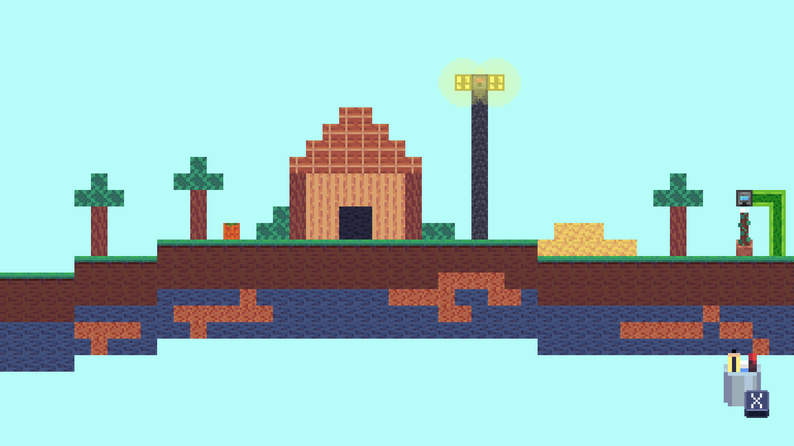
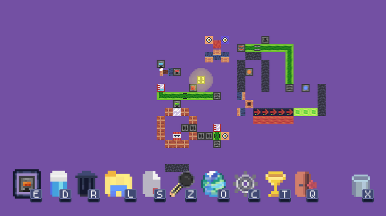
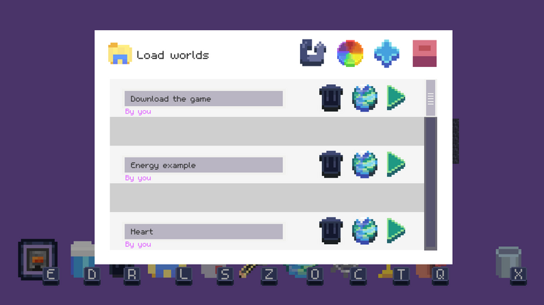
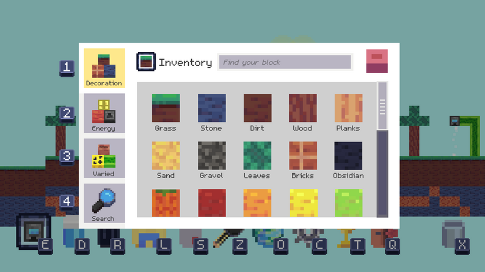
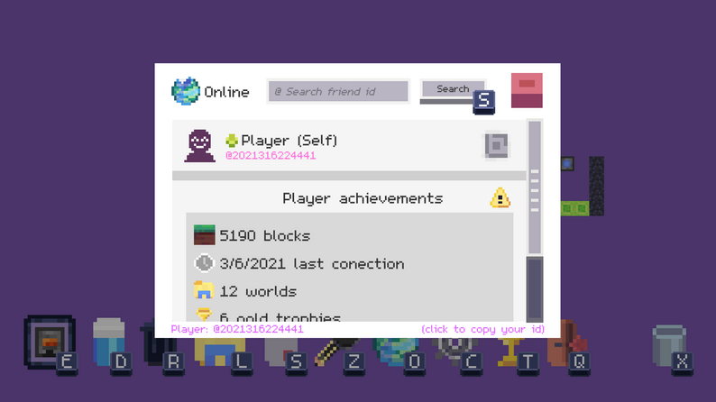

#  Sandlife - Juego Sandbox 

## 🎮 Descripción

**Sandlife** es un emocionante juego de construcción de código abierto que fomenta la creatividad. Este juego se basa en un sistema de construcción con bloques que tienen la capacidad única de interactuar en el mundo virtual. En Sandlife, puedes dar rienda suelta a tu imaginación utilizando una amplia variedad de bloques para construir entornos impresionantes.

## 📋 Características

- **Construcción Creativa:** Utiliza una diversidad de bloques para construir paisajes únicos y creativos.
  
- **Guardado y Carga de Mundos:** Nunca pierdas tu progreso. Guarda tus mundos y cárgalos en cualquier momento.

- **Interactividad de Bloques:** Descubre cómo los bloques pueden interactuar entre sí y con el entorno, añadiendo capas de complejidad y diversión a tus creaciones.

## 💻 Compilacion 

### Requisitos

- [Unity](https://unity.com/) 2022 o posterior

### Pasos de Instalación

1. Clona el repositorio: `git clone https://github.com/Asierso/Sandlife.git`
2. Abre el proyecto en Unity.
3. Exporta tu build para Android o Windows desde las propiedades del editor

## ¿Te Atreves a Probarlo?

¡Descarga Sandlife y comienza a construir tus propios mundos ahora!

[Enlace de Descarga](https://asierso-studio.itch.io/sandlife)

## Screenshots del juego

